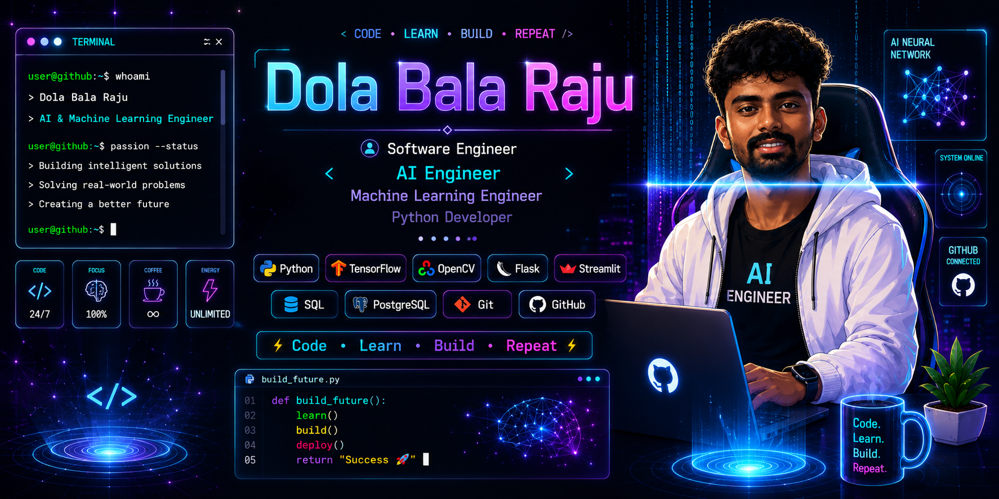
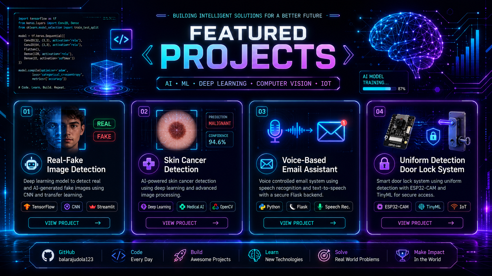
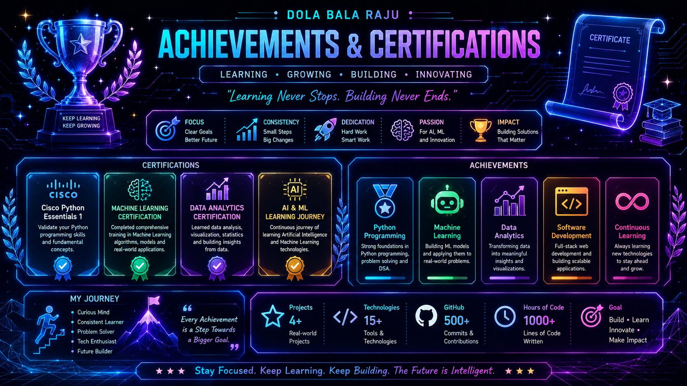
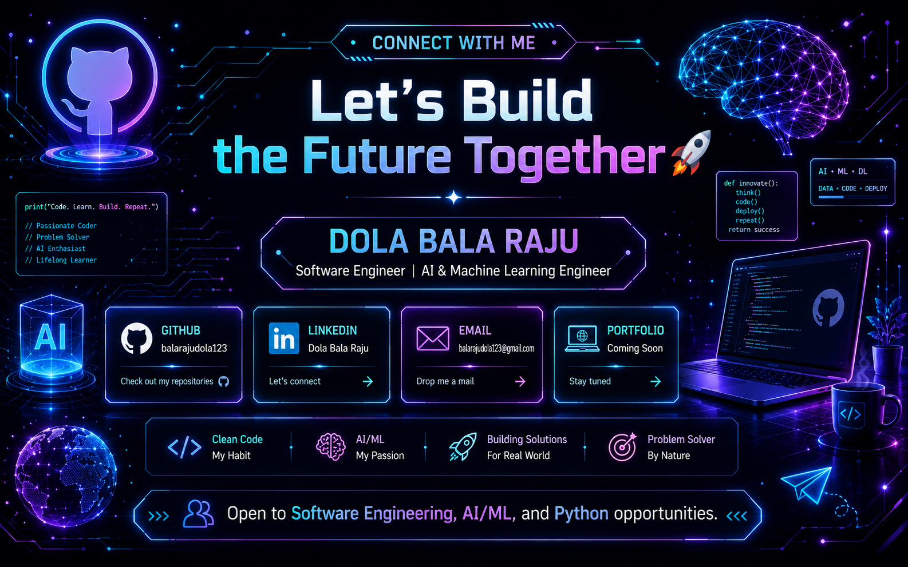

<!-- ============================= -->
<!--      DOLA BALA RAJU          -->
<!-- ============================= -->

<h1 align="center">Hi 👋, I'm Dola Bala Raju</h1>

  

  

  

---

# 👨‍💻 About Me

- 🎓 B.Tech CSE Graduate (2026)
- 💻 Software Engineer
- 🤖 AI & Machine Learning Engineer
- 🐍 Python Developer
- 🌱 Learning Deep Learning & Computer Vision
- 🚀 Open to Software Engineering & AI/ML Opportunities

---

# 🚀 Tech Stack

---

# 📊 GitHub Stats

---

# 🔥 GitHub Streak

---

# 🏆 GitHub Trophies

---

# 📈 Contribution Graph

---

# 🐍 Contribution Snake

<picture>
  <source media="(prefers-color-scheme: dark)" srcset="https://raw.githubusercontent.com/balarajudola123/balarajudola123/output/github-contribution-grid-snake-dark.svg">
  <source media="(prefers-color-scheme: light)" srcset="https://raw.githubusercontent.com/balarajudola123/balarajudola123/output/github-contribution-grid-snake.svg">
  
</picture>

---

# 🚀 Featured Projects

| Project | Technologies |
|----------|--------------|
| 🤖 Real-Fake Image Detection | TensorFlow • CNN • Streamlit |
| 🩺 Skin Cancer Detection | Python • Deep Learning |
| 📧 Voice-Based Email Assistant | Flask • Speech Recognition |
| 🔐 Uniform Detection Door Lock | ESP32-CAM • TinyML |

---

# 🏅 Certifications

- 🏆 Cisco Python
- 🤖 Machine Learning
- 📊 Data Analytics
- 🚀 AI & ML Learning

---

# 🌐 Connect With Me

---

# 💬 Quote

> **"Turning Ideas into Intelligent Solutions through AI, Machine Learning, and Software Engineering."**

---

⭐ Thanks for visiting my profile! ⭐

